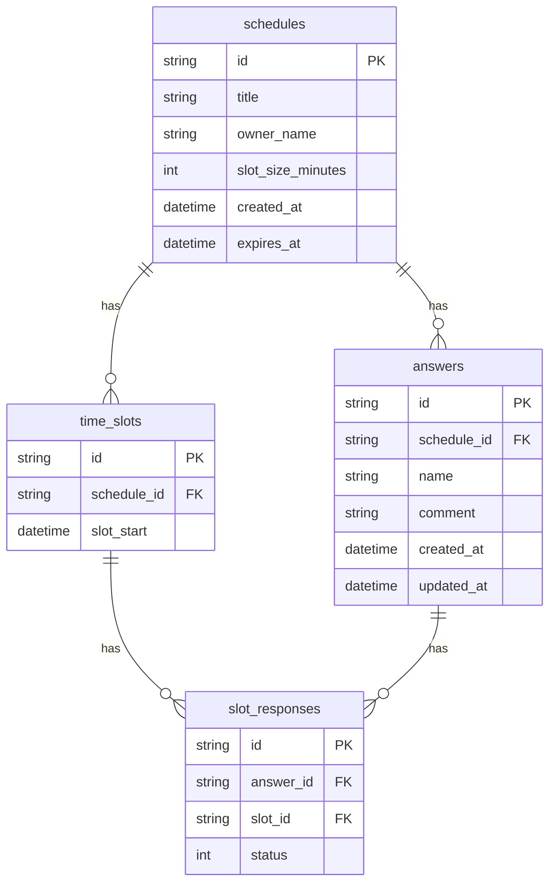

# DB 設計書（2025 年 5 月版・可変スロット対応）

本ドキュメントは「チョイスケ」Web サービスの DB 設計（論理設計＋物理設計、スロット可変対応）をまとめたものです。

---

## 関連ドキュメント

- [API 設計書](./api-design.md)
- [技術選定](./tech-stack.md)

---

## 1. エンティティ一覧

- schedules（スケジュール調整）
- time_slots（候補スロット）
- answers（参加者回答）
- slot_responses（スロットごとの回答）

---

## 2. 各エンティティの概要

### schedules

- 日程調整の親エンティティ。タイトル、主催者名、スロットサイズ、作成日時、有効期限などを持つ。

### time_slots

- スケジュールごとに設定された「可変長の時間スロット」（例: 2025-05-17 13:00-13:30, 13:30-14:00 など）を管理。

### answers

- 参加者ごとの回答（名前、コメント、各スロットへの回答）。

### slot_responses

- 各スロットごとに参加者が「OK/NG/未回答」等で可否を数値（例: 1=OK, 2=NG, 0=未回答など）で回答。

---

## 3. 関連・リレーション

- schedules 1 : N time_slots
- schedules 1 : N answers
- answers 1 : N slot_responses
- time_slots 1 : N slot_responses

---

## 4. テーブル定義（物理設計）

### schedules（スケジュール調整）

| カラム名          | 型           | 主キー | NOT NULL | デフォルト        | 説明                     |
| ----------------- | ------------ | ------ | -------- | ----------------- | ------------------------ |
| id                | VARCHAR(36)  | ○      | ○        | UUID 等           | スケジュール ID          |
| title             | VARCHAR(255) |        | ○        |                   | タイトル                 |
| owner_name        | VARCHAR(100) |        |          |                   | 主催者名                 |
| slot_size_minutes | INT          |        | ○        | 30                | スロットの長さ（分単位） |
| created_at        | DATETIME     |        | ○        | CURRENT_TIMESTAMP | 作成日時                 |
| expires_at        | DATETIME     |        | ○        |                   | 有効期限                 |

---

### time_slots（候補スロット）

| カラム名    | 型          | 主キー | NOT NULL | デフォルト | 説明                |
| ----------- | ----------- | ------ | -------- | ---------- | ------------------- |
| id          | VARCHAR(36) | ○      | ○        | UUID 等    | スロット ID         |
| schedule_id | VARCHAR(36) |        | ○        |            | スケジュール ID(FK) |
| slot_start  | DATETIME    |        | ○        |            | スロット開始日時    |

---

### answers（参加者回答）

| カラム名    | 型           | 主キー | NOT NULL | デフォルト        | 説明                |
| ----------- | ------------ | ------ | -------- | ----------------- | ------------------- |
| id          | VARCHAR(36)  | ○      | ○        | UUID 等           | 回答 ID             |
| schedule_id | VARCHAR(36)  |        | ○        |                   | スケジュール ID(FK) |
| name        | VARCHAR(100) |        |          |                   | 参加者名            |
| comment     | TEXT         |        |          |                   | 回答コメント        |
| created_at  | DATETIME     |        | ○        | CURRENT_TIMESTAMP | 回答作成日時        |
| updated_at  | DATETIME     |        | ○        | CURRENT_TIMESTAMP | 回答更新日時        |

---

### slot_responses（スロットごとの回答）

| カラム名  | 型          | 主キー | NOT NULL | デフォルト | 説明                                          |
| --------- | ----------- | ------ | -------- | ---------- | --------------------------------------------- |
| id        | VARCHAR(36) | ○      | ○        | UUID 等    | 回答詳細 ID                                   |
| answer_id | VARCHAR(36) |        | ○        |            | 回答 ID(FK)                                   |
| slot_id   | VARCHAR(36) |        | ○        |            | スロット ID(FK)                               |
| status    | INT         |        | ○        |            | 回答ステータス（1=OK,2=NG,0=未回答,3=未確定） |

---

### 備考

- status は数値（例: 1=OK, 2=NG, 0=未回答, 3=未確定）で管理
- answers に comment カラムを追加し、参加者が自由記述コメントを残せる
- schedules.slot_size_minutes でスロットの長さ（例: 15, 30, 60 分など）を管理
- time_slots で各スロットの開始・終了日時を明示的に保持（可変長対応）
- slot_responses で各スロットごとの可否を管理
- 日付・時間帯の柔軟な組み合わせや可変スロットサイズに対応

---

## 5. ER 図（エンティティ・リレーションシップ図）

---

ご要望や仕様変更があれば随時見直します。
