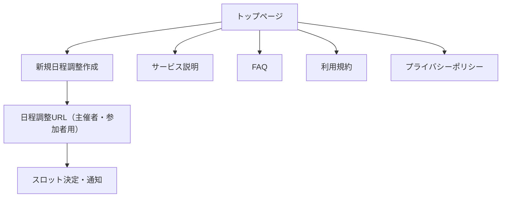

# 画面遷移設計（2025 年 5 月版・最新）

本ドキュメントは「チョイスケ」Web サービスの主要な画面遷移と各画面の役割・概要をまとめたものです。

---

## 1. 画面一覧・遷移フロー

```
[トップページ]
   │
   └─▶ [新規日程調整作成]
            │
            └─▶ [日程調整URL（主催者・参加者用）]
                        │
                        ├─▶ [スロットごとに参加可否を選択]
                        │
                        ├─▶ [集計結果表示]
                        │
                        └─▶ [スロット決定・通知]
```

---

## 2. 各画面の概要

### 2.1. トップページ（/）

- サービス説明、使い方ガイド、日程調整作成ボタン
- 既存の日程調整 URL 入力欄（任意）

### 2.2. 新規日程調整作成（/new など）

- 主催者が候補日・時間帯・スロットサイズ（例: 15/30/60 分）を指定
- UI 上でカレンダーやタイムピッカーから複数スロットを選択
- 「調整を作成」ボタンで URL 発行

### 2.3. 日程調整 URL（/s/[id] など）

- 主催者・参加者共通の調整ページ
- スロットごとに「OK/NG/未回答/未確定（1/2/0/3）」で可否を選択
- 参加者はコメントも入力可能
- 回答編集・再送信機能
- 集計結果のリアルタイム表示
- 主催者のみ「スロット決定」ボタン

### 2.4. スロット決定・通知（/s/[id]/result など）

- 決定したスロットの表示
- 参加者への通知（URL 共有・メール送信等）
- 再調整・新規作成への導線

### 2.5. その他

- 利用規約・プライバシーポリシー（/terms, /privacy）
- サービス説明・FAQ（/about, /faq）
- 広告表示領域（全画面共通または一部画面）

---

## 3. 画面遷移図（簡易）



---

## 4. シーケンス図（主要シナリオ）

```mermaid
sequenceDiagram
    participant 主催者
    participant Webブラウザ
    participant サーバー(Next.js API)
    participant DB
    participant 参加者

    主催者->>Webブラウザ: トップページ表示・「新規作成」クリック
    Webブラウザ->>主催者: 日程・スロットサイズ・時間帯入力
    主催者->>Webブラウザ: スロット選択
    Webブラウザ->>サーバー(Next.js API): 日程調整データ送信
    サーバー(Next.js API)->>DB: データ保存
    サーバー(Next.js API)-->>Webブラウザ: 調整用URL発行
    Webブラウザ->>主催者: URL表示・コピー

    主催者->>参加者: URL共有
    参加者->>Webブラウザ: URLアクセス
    Webブラウザ->>サーバー(Next.js API): 日程調整データ取得
    サーバー(Next.js API)->>DB: データ取得
    サーバー(Next.js API)-->>Webブラウザ: データ返却
    Webブラウザ
    参加者->>Webブラウザ: 回答送信
    Webブラウザ->>サーバー(Next.js API): 回答データ送信
    サーバー(Next.js API)->>DB: 回答保存

    主催者->>Webブラウザ: 集計画面表示
    Webブラウザ->>サーバー(Next.js API): 集計データ取得
    サーバー(Next.js API)->>DB: データ取得
    サーバー(Next.js API)-->>Webブラウザ: 集計データ返却
    Webブラウザ->>主催者: 集計結果表示

    主催者->>Webブラウザ: スロット決定操作
    Webブラウザ->>サーバー(Next.js API): 決定データ送信
    サーバー(Next.js API)->>DB: 決定内容保存
    サーバー(Next.js API)-->>Webブラウザ: 完了応答
    Webブラウザ->>主催者: 決定内容表示
    Webブラウザ->>参加者: 決定内容通知（URL共有・メール等）
```

---

## 5. 備考

- 画面遷移や URL 設計は今後の要件追加・仕様変更に応じて見直します。
- 画面ごとの詳細 UI・ワイヤーフレームは別途資料を作成予定です。
